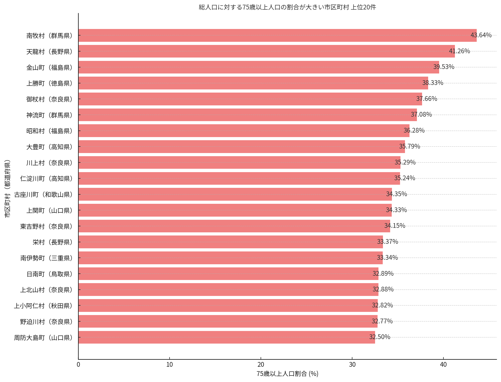
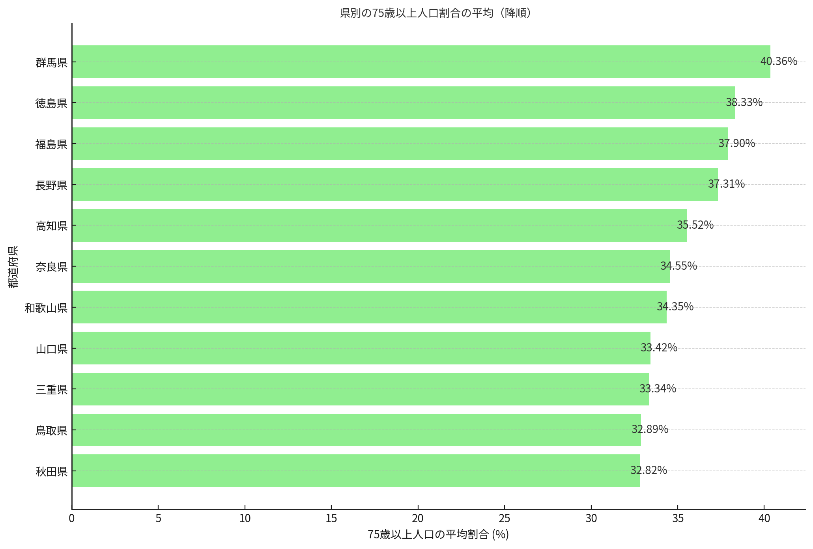
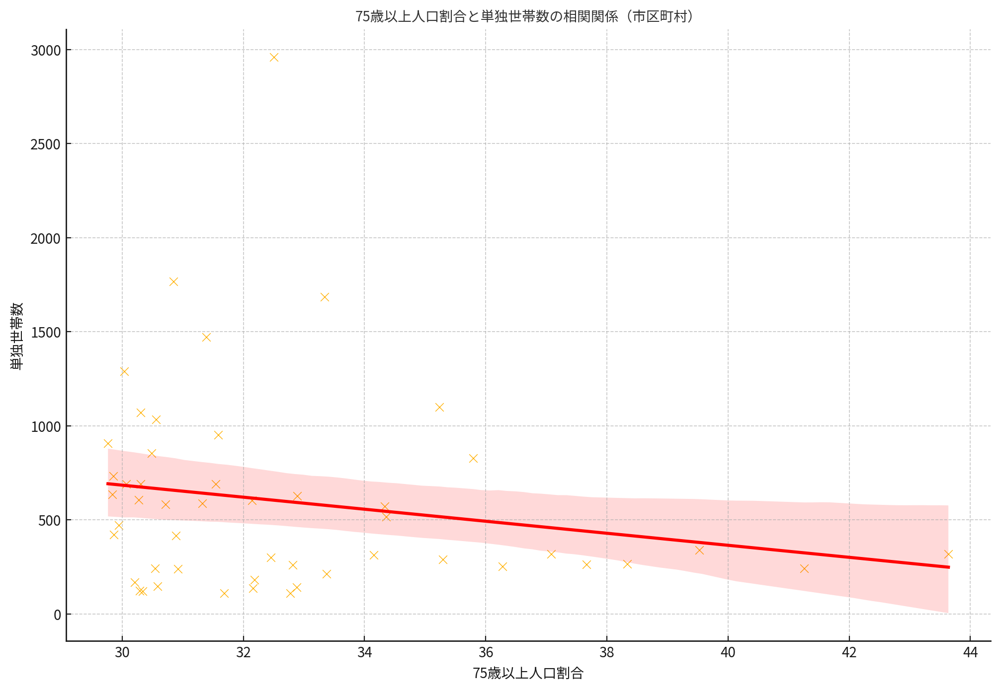

# Chat AssistantAPI (Python)

このプロジェクトは、OpenAI AssistantAPI を使用してアップロードしたファイルを解析し、インタラクティブにユーザーの質問に答える AI アシスタントです。EXCELファイルと日本語フォントを ZIP 形式でアップロードし、日本語対応したチャートやグラフを作成するシナリオの検証用途として作成されています。

## 制約事項

AssistantAPI は現在プレビューであり、日本語フォントをアップロードし利用するシナリオにおいては、2025年2月時点で以下の環境で安定稼働する事を確認してています。`100K TPM` 程度のクォーター割り当てがあるのが望ましいです。

- リージョン (Glbal Standard) : `eastus2`
- GPT-4o モデル バージョン : `2024-05-13`
- API_VERSION : `2024-05-01-preview`

## セットアップ

1. Python 仮想環境を作成し、アクティブにします。

    ```sh
    python -m venv venv
    source venv/bin/activate  # Windows の場合は `venv\Scripts\activate`
    ```

2. 必要なパッケージをインストールします。

    ```sh
    pip install -r requirements.txt
    ```

3. 必要な環境変数を設定します。VSCode からデバッグ実行をする場合は、拡張機能を利用し .env ファイルに設定を記述してください。

    ```plaintext
    AZURE_OPENAI_ENDPOINT="https://your-openai-endpoint"
    AZURE_OPENAI_API_KEY="your-api-key"
    API_VERSION="2024-05-01-preview"
    DEPLOYMENT_NAME="your-deployment-name"
    ```

## 使用方法

1. スクリプトを実行します。

    ```sh
    python main.py
    ```

2. プロンプトに従ってユーザー入力を行います。終了するには `exit` と入力します。

## チャット例

1. EXCEL シートを読み取り、総人口に対して75歳以上人口の割合が大きい市区町村の上位20件を横棒グラフで表してください。縦軸は降順に記述してください。グラフには割合をパーセンテージでラベル表記してください。またそれぞれの市区町村がどの都道府県に属しているかわかるようにラベリングしてください。

    

2. 続けて県別に集計して降順に並べてください。

    

3. EXCEL シートを読み取り、総人口に対して75歳以上人口の割合が大きい市区町村と単独世帯数に相関関係があれば可視化して下さい。

    上記の散布図は、75歳以上人口割合と単独世帯数の相関関係を示しています。点は各市区町村のデータポイントを示し、赤い線は回帰直線です。また、計算された相関係数は約-0.190です。この値は、75歳以上人口割合と単独世帯数の間に弱い負の相関関係があることを示唆しています。75歳以上人口の割合が増えるにつれて単独世帯数がわずかに減少する傾向が見られますが、その関係性 は非常に弱いです。

## デバッグ

VSCode からデバッグ実行する場合は、`.vscode/launch.json` ファイルが用意されています。`F5` キーを押してデバッグ実行を行うことができます。