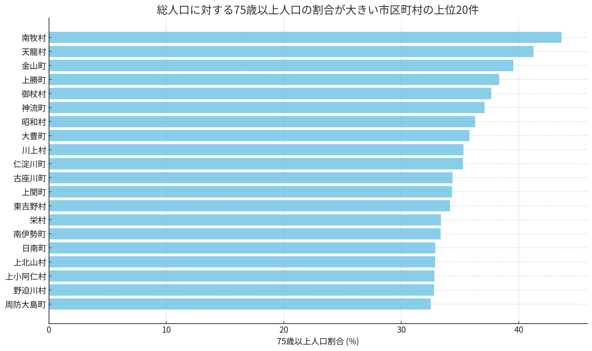
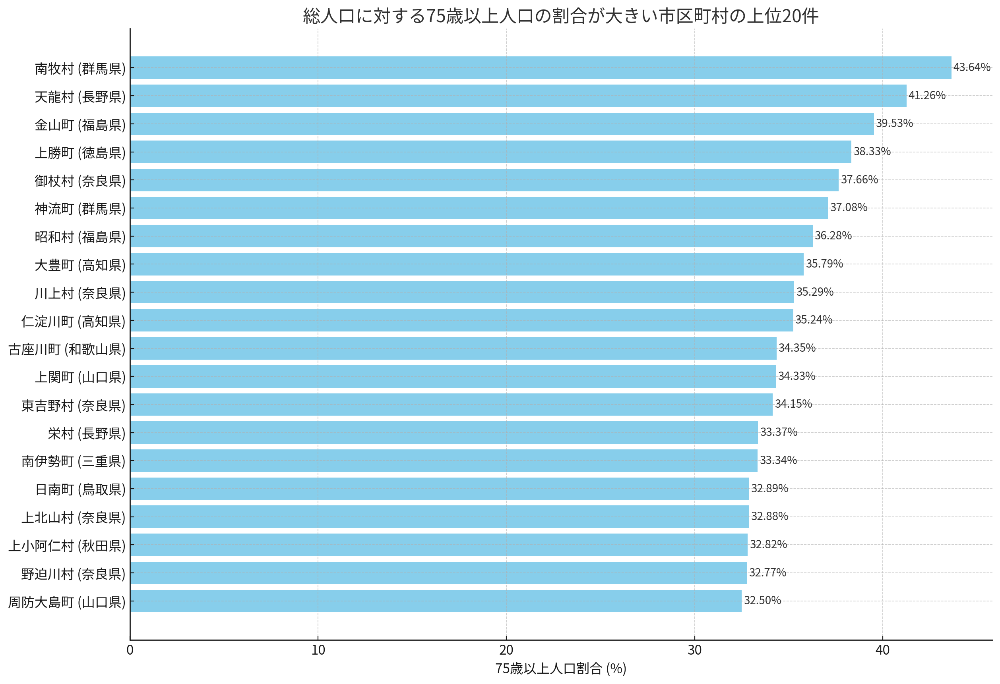
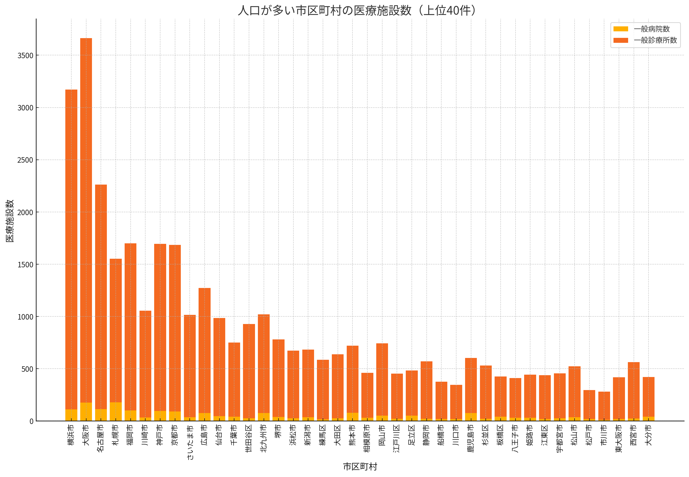
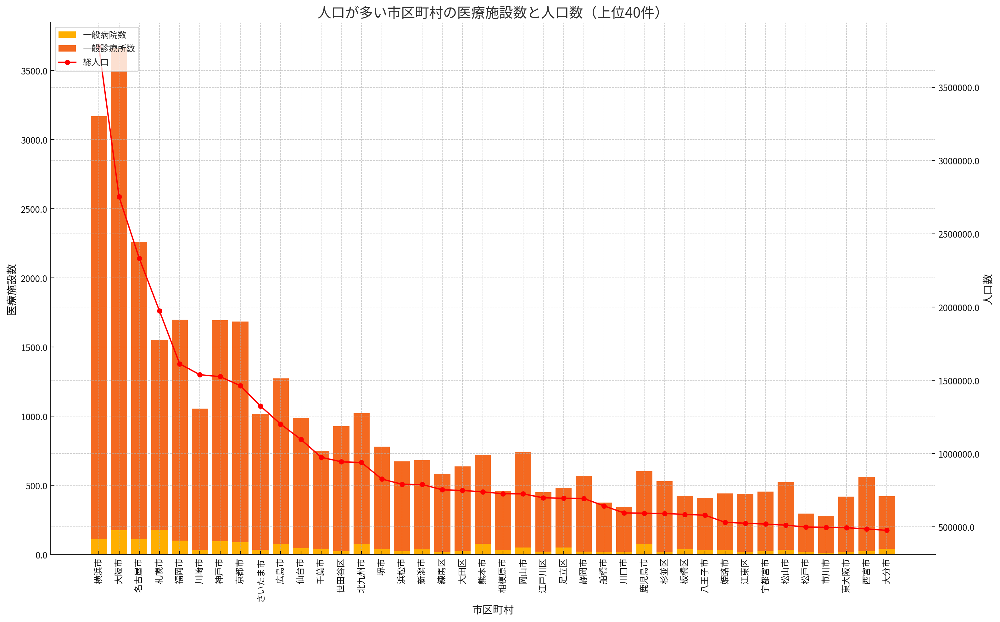
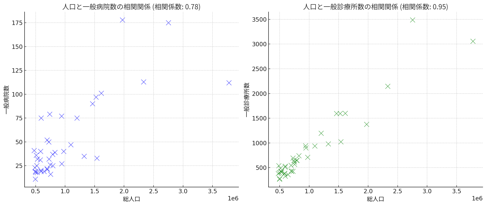

# Chat Assistants Code Interpreter (Python)

このプロジェクトは、OpenAI Assistants Code Interpreter を使用してアップロードした EXCEL ファイルを解析し、インタラクティブにユーザーの質問に答える AI アシスタントです。

EXCELファイルと日本語フォントを ZIP 形式でアップロードし、日本語対応したチャートやグラフを作成するシナリオの検証用途として作成されています。

## 日本語フォント

日本語フォントを ZIP にアーカイブしアップロードして利用するシナリオには制約があります。現状アーカイブした日本語フォントと EXCEL ファイルのアップロード場所を同じディレクトリに明示的に指定する事で安定した動作を確認しています。

以下のコード例では、Python 仮想環境内の `/mnt/data/upload_files` を明示的なアップロード場所として指定しています。

```python
# スレッドを作成
thread = client.beta.threads.create(
    messages=[
        {
            "role": "user",
            "content": "アップロードされた Font.zip と Excel.zip を /mnt/data/upload_files に展開してください。これらの ZIP ファイルには解析対象の EXCEL ファイルと日本語フォント NotoSansJP.ttf が含まれています。展開した先にある EXCEL ファイルをユーザーの指示に従い解析してください。EXCEL データからグラフやチャート画像を生成する場合、タイトル、軸項目、凡例等に NotoSansJP.ttf を利用してください。",
            "attachments":[
                {
                "file_id": file_font.id,
                "file_id": file_excel.id,
                "tools": [{"type": "code_interpreter"}]
                }
            ]
        }
    ]
)
```

## 検証環境

2025年2月時点で Assistants API はプレビュー機能であり、[サポートされているモデルとリージョン](https://learn.microsoft.com/ja-jp/azure/ai-services/openai/concepts/models?tabs=global-standard%2Cstandard-chat-completions#assistants-preview)が限られています。本検証では、以下の環境を利用しています。

- リージョン (Glbal Standard) : `westus`
- GPT-4o モデル バージョン : `2024-05-13`
- API_VERSION : `2024-05-01-preview`

## セットアップ

1. Python 仮想環境を作成し、アクティブにします。

    ```sh
    python -m venv venv
    source venv/bin/activate  # Windows の場合は `venv\Scripts\activate`
    ```

2. 必要なパッケージをインストールします。

    ```sh
    pip install -r requirements.txt
    ```

3. 必要な環境変数を設定します。VSCode からデバッグ実行をする場合は、拡張機能を利用し .env ファイルに設定を記述してください。

    ```plaintext
    AZURE_OPENAI_ENDPOINT="https://your-openai-endpoint"
    AZURE_OPENAI_API_KEY="your-api-key"
    API_VERSION="2024-05-01-preview"
    DEPLOYMENT_NAME="your-deployment-name"
    ```

## 使用方法

1. スクリプトを実行します。

    ```sh
    python main.py
    ```

2. プロンプトに従ってユーザー入力を行います。終了するには `exit` と入力します。

## チャット例

`User:` 総人口に対して75歳以上の人口割合が大きい市区町村の上位20件を降順で横棒グラフで表してください。

`Assistant:` 総人口に対する75歳以上人口の割合が大きい市区町村の上位20件を横棒グラフで表しました。各市区町村の名前、割合を日本語で表示しています。追加の分析や質問があればお知らせください。



`User:` 市区町村がどの都道府県に属しているかわかるように記述してください。またグラフ上にパーセンテージの数値も記述してください。

`Assistant:` 総人口に対する75歳以上人口の割合が大きい市区町村の上位20件を、都道府県名と市区町村名を組み合わせて横棒グラフで表しました。また、各バーの上にパーセンテージ数値も記述しました。ご覧いただきありがとうございます。追加の分析や他の質問があればお知らせください。



`User:` 人口が多い市区町村の上位40件と、その市区町村の医療施設数をグラフにしてください。

`Assistant:` 人口が多い市区町村の上位40件とそれらの市区町村の医療施設数（一般病院数および一般診療所数）をグラフ化しました。



他に解析や処理のリクエストがありましたらお知らせください。

`User:` 人口数の数値も上手く同じグラフ内に表現する事は可能でしょうか？

`Assistant:` 人口数を追加したグラフを描画しました。このグラフには、医療施設数（一般病院数および一般診療所数）の積み上げバープロットと、総人口のラインプロットの両方が表示されています。



他にご要望がありましたら、お知らせください。

`User:` 棒グラフと折れ線グラフの項目に相関関係はありますか？可視化出来るとありがたいです。

`Assistant:` 医療施設数（一般病院数および一般診療所数）と総人口の相関関係を示す散布図を作成しました。これにより、総人口と医療施設数の関係を見ることができます。

相関係数は以下の通りです：
- 総人口と一般病院数の相関係数: \(0.60\)
- 総人口と一般診療所数の相関係数: \(0.88\)



他にご要望がありましたら、お知らせください。

## デバッグ

VSCode からデバッグ実行する場合は、`.vscode/launch.json` ファイルが用意されています。`F5` キーを押してデバッグ実行を行うことができます。